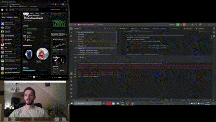
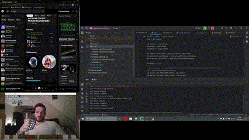
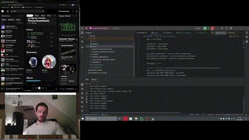
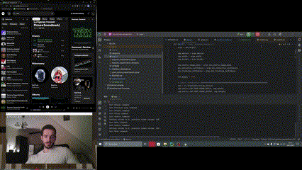
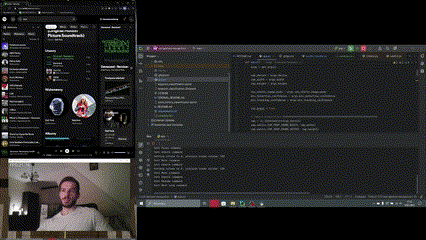

# NAI Gesture Recognition Spotify Controller

This is an application for NAI class at PJATK university. 
The goal of this repository is to create an application that's able to control Spotify player through gestures made on webcam. 

The available commands are: 
- Pause 

- Resume 

- Mute  

- Unmute  

- Next song  

- Previous song  

## How to use

1. Python 3.9 > 
2. Ensure you have a webcam connected (otherwise the app will fail)
3. Ensure that all requirements are installed
4. Ensure that there is .env file at directory root with `SPOTIFY_CLIENT_ID` and `SPOTIFY_SECRET` envs specified
5. Run app.py and follow the instructions (you'll need to verify your spotify acc first time using this app) 

## Author

- Michał Cichowski